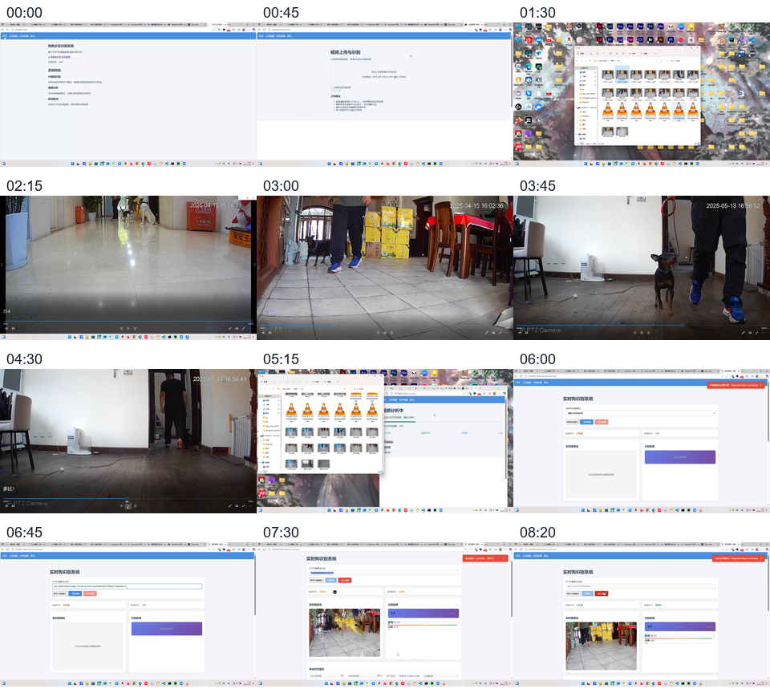
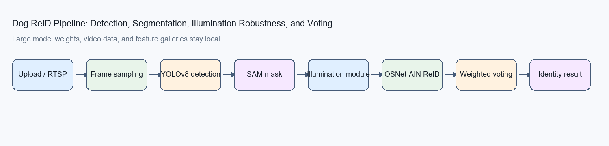
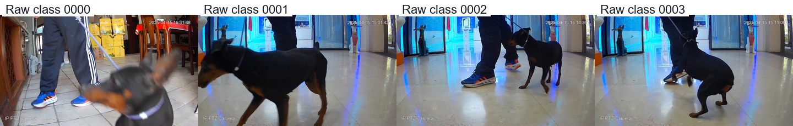
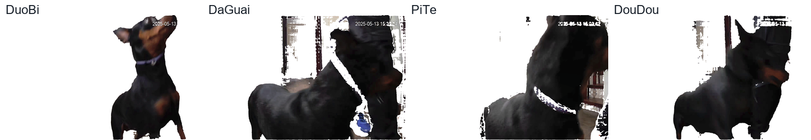
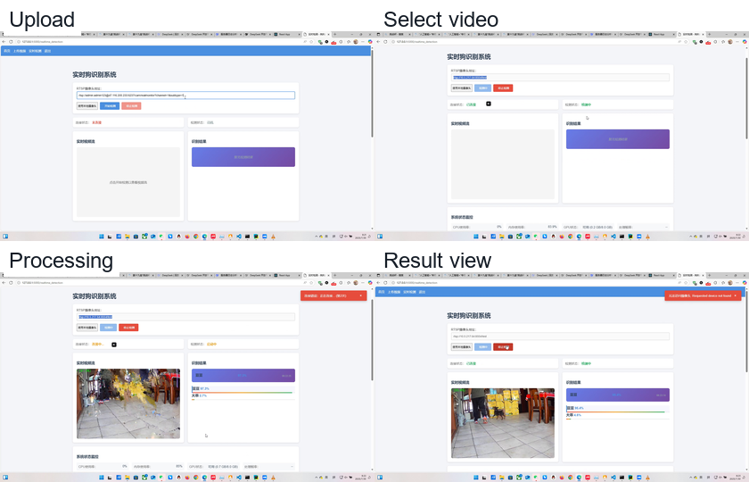

# Dog ReID Based on YOLO, SAM, and Illumination Invariance

A Flask-based prototype for dog re-identification from uploaded videos or real-time camera streams. It combines YOLOv8 dog detection, Segment Anything mask refinement, quality-based key-frame filtering, an illumination-invariance preprocessing module, OSNet-AIN feature extraction, and weighted voting over a local dog feature gallery.

This is a public showcase repository. It contains source code, UI templates, architecture documentation, compressed lightweight model assets, and setup instructions. It does not publish private feature galleries, uploaded videos, SQLite databases, raw datasets, or the oversized SAM checkpoint.

## At a Glance

| Area | Implementation |
| --- | --- |
| Web app | Flask, Flask-Login, Flask-SQLAlchemy, Flask-WTF |
| Detection | YOLOv8 segmentation for dog localization |
| Mask refinement | SAM for dog silhouette extraction |
| Robustness module | Lightweight illumination-invariance preprocessing |
| ReID backbone | OSNet-AIN style feature extraction |
| Decision logic | Frame-level similarity plus two-stage weighted voting |
| Public data policy | Only screenshots, GIFs, and compressed non-private model assets are tracked |

## Demo

Short preview:


Full local demonstration GIF:


The complete demo timeline is also shown as a static contact sheet for faster review:





## What This Project Demonstrates

- Video upload and real-time stream workflows in a Flask web application.
- Dog segmentation with YOLOv8 and SAM to isolate usable silhouettes.
- Frame quality filtering using sharpness, contrast, and silhouette integrity checks.
- A lightweight illumination-invariance module before ReID feature extraction.
- OSNet-AIN based feature extraction with local gallery matching.
- Two-stage weighted voting to aggregate frame-level identity evidence.
- Runtime asset isolation: private videos and gallery features stay local.
- Practical model packaging: small model archives are included, while oversized assets are documented.

## Repository Scope

This repository is suitable for portfolio review and technical discussion. It is not a production animal-identification service. Reliable deployment would require a larger validated dataset, model cards, privacy review, reproducible training scripts, robust monitoring, and controlled benchmark reporting.

The following runtime assets are intentionally excluded:

| Excluded artifact | Reason |
| --- | --- |
| `fea_data/sam_vit_b_01ec64.pth` | 375 MB; still 335 MB after 7z compression, above GitHub's normal 100 MB file limit. |
| `fea_data/*.npy` | Private feature gallery data. |
| `uploads/` | User-uploaded videos. |
| `instance/*.db` | Local application database. |
| `temp_frames/` | Generated intermediate frames. |
| `__pycache__/` | Python runtime cache. |

## Dataset and Processing Snapshots

The private local dataset is organized into four raw dog-video classes. Only still-frame snapshots are published here.



The processed frame gallery shows representative SAM/YOLO-refined key frames for the four dog identities used in the local feature database.



The web workflow includes upload selection, processing, progress display, and final identity results.



Local material summary:

| Source | Local count |
| --- | --- |
| Raw class `0000` | 16 MP4 + 7 DAV videos |
| Raw class `0001` | 25 MP4 + 9 DAV videos |
| Raw class `0002` | 24 MP4 + 13 DAV videos |
| Raw class `0003` | 25 MP4 + 8 DAV videos |
| Processed DuoBi frames | 276 PNG frames |
| Processed DaGuai frames | 294 PNG frames |
| Processed PiTe frames | 1447 PNG frames |
| Processed DouDou frames | 1141 PNG frames |

## Architecture

```mermaid
flowchart LR
    A[Upload / RTSP stream] --> B[Frame sampling]
    B --> C[Frame quality filtering]
    C --> D[YOLOv8 dog detection]
    D --> E[SAM mask refinement]
    E --> F[Illumination-invariant preprocessing]
    F --> G[OSNet-AIN feature extraction]
    G --> H[Gallery matching]
    H --> I[Weighted voting]
    I --> J[Dog identity result]
```



More details are available in [`docs/architecture.md`](docs/architecture.md).

## Runtime Assets

The repository includes two compressed model archives under [`model_assets/`](model_assets/):

| Archive | Original file | Original size | 7z size | GitHub status |
| --- | --- | ---: | ---: | --- |
| `model_assets/yolov8m-seg.7z` | `yolov8m-seg.pt` | 54.9 MB | 49.2 MB | Included |
| `model_assets/illumination_robust_model.7z` | `illumination_robust_model.pth` | 26.6 MB | 7.3 MB | Included |
| Not included | `sam_vit_b_01ec64.pth` | 375.0 MB | 335.5 MB | Too large for normal GitHub push |
| Not included | `universal_features_h.npy` | 1.3 MB | Not packaged | Private dog gallery features |

Create `fea_data/` locally and extract or place the required assets there:

```text
fea_data/
|-- yolov8m-seg.pt
|-- sam_vit_b_01ec64.pth
|-- illumination_robust_model.pth
`-- universal_features_h.npy
```

Extract the included archives with 7-Zip:

```powershell
7z x model_assets\yolov8m-seg.7z -ofea_data
7z x model_assets\illumination_robust_model.7z -ofea_data
```

Then place `sam_vit_b_01ec64.pth` and the private `universal_features_h.npy`
locally before running full inference.

You can also override paths with environment variables. See [`.env.example`](.env.example).

## Quick Start

```powershell
python -m venv .venv
.\.venv\Scripts\Activate.ps1
pip install -r requirements.txt
copy .env.example .env
python run.py
```

Open:

```text
http://127.0.0.1:5000
```

For GPU environments, install a PyTorch build that matches your CUDA version before installing the remaining packages.

## Configuration

Important environment variables:

| Variable | Default | Purpose |
| --- | --- | --- |
| `DATABASE_URL` | `sqlite:///dog_reid.db` | Flask-SQLAlchemy database URL. |
| `UPLOAD_FOLDER` | `uploads` | Runtime video upload directory. |
| `MODEL_DIR` | `fea_data` | Base directory for model assets. |
| `YOLO_MODEL_PATH` | `fea_data/yolov8m-seg.pt` | YOLOv8 segmentation model. |
| `SAM_CHECKPOINT_PATH` | `fea_data/sam_vit_b_01ec64.pth` | SAM checkpoint. |
| `REID_MODEL_PATH` | `fea_data/illumination_robust_model.pth` | ReID checkpoint. |
| `DOG_FEATURES_PATH` | `fea_data/universal_features_h.npy` | Gallery feature database. |
| `TEMP_FRAME_DIR` | `temp_frames` | Temporary frame directory. |

## Project Layout

```text
.
|-- app/
|   |-- core/                   # YOLO/SAM, ReID, camera, and real-time processing
|   |-- static/                 # Web assets
|   |-- templates/              # Flask templates
|   |-- models.py               # User, video, and progress models
|   |-- routes.py               # Web routes and APIs
|   `-- utils.py                # Upload and processing utilities
|-- docs/
|   |-- architecture.md
|   `-- figures/
|-- fea_data/README.md          # Runtime asset placement guide
|-- model_assets/               # Compressed small model archives
|-- config.py
|-- requirements.txt
`-- run.py
```

## Public Repository Notes

The code expects local runtime assets for full inference. Without the SAM checkpoint and private feature gallery, the web app structure can still be reviewed, but video processing and real-time ReID endpoints will fail when they try to load the missing assets. This is deliberate: the public repository should remain usable for review while avoiding private data exposure and GitHub file-size failures.
