# Architecture

This project combines object segmentation, mask refinement, illumination-aware
preprocessing, and feature matching for a dog re-identification prototype.

## End-to-End Flow

```mermaid
flowchart LR
    A[Video upload or RTSP stream] --> B[Frame sampling]
    B --> C[Quality filter]
    C --> D[YOLOv8 dog detection]
    D --> E[SAM mask refinement]
    E --> F[Silhouette integrity check]
    F --> G[Illumination-invariant module]
    G --> H[OSNet-AIN feature extraction]
    H --> I[Gallery similarity search]
    I --> J[Two-stage weighted voting]
    J --> K[Identity and confidence output]
```

## Main Components

| Component | File | Responsibility |
| --- | --- | --- |
| Flask app factory | `app/__init__.py` | App configuration, database, login manager, template filters. |
| Web routes | `app/routes.py` | Upload workflow, processing status, results, real-time endpoints. |
| Video utilities | `app/utils.py` | Upload validation, persisted video metadata, background processing. |
| ReID system | `app/core/dog_reid_system.py` | Key-frame extraction, illumination processing, OSNet feature extraction, voting. |
| Segmentation | `app/core/yolo_segment.py` | YOLOv8 dog detection and SAM mask refinement. |
| Real-time system | `app/core/realtime_detection_system.py` | Frame queue, cached detection results, periodic ReID trigger. |
| Camera manager | `app/core/camera_system.py` | Local camera and RTSP stream lifecycle management. |

## Design Notes

- YOLO and SAM are loaded lazily because their checkpoints are large.
- Uploaded videos and temporary frames are treated as runtime data and excluded from Git.
- The illumination-invariance module is intentionally lightweight so it can run before feature extraction without dominating latency.
- The gallery feature database is loaded from a local `.npy` file and can be replaced without changing source code.
